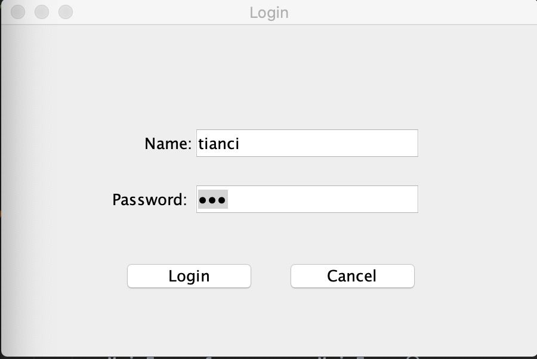
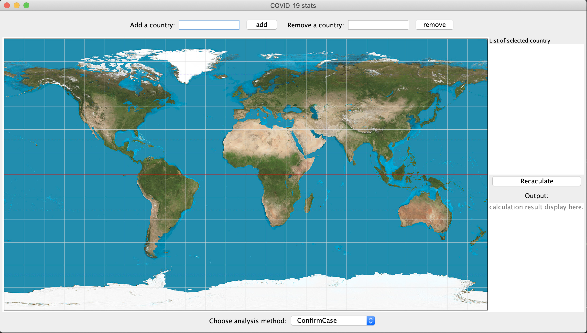
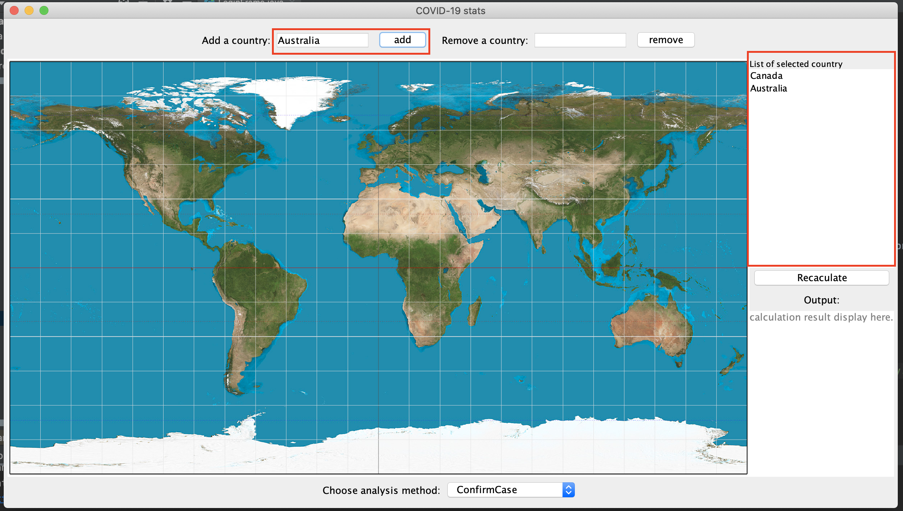
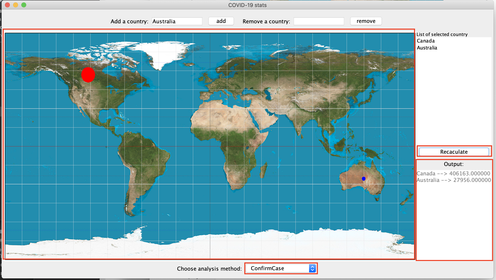
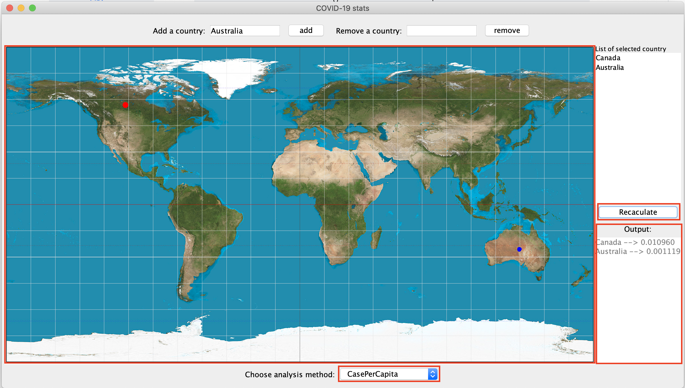
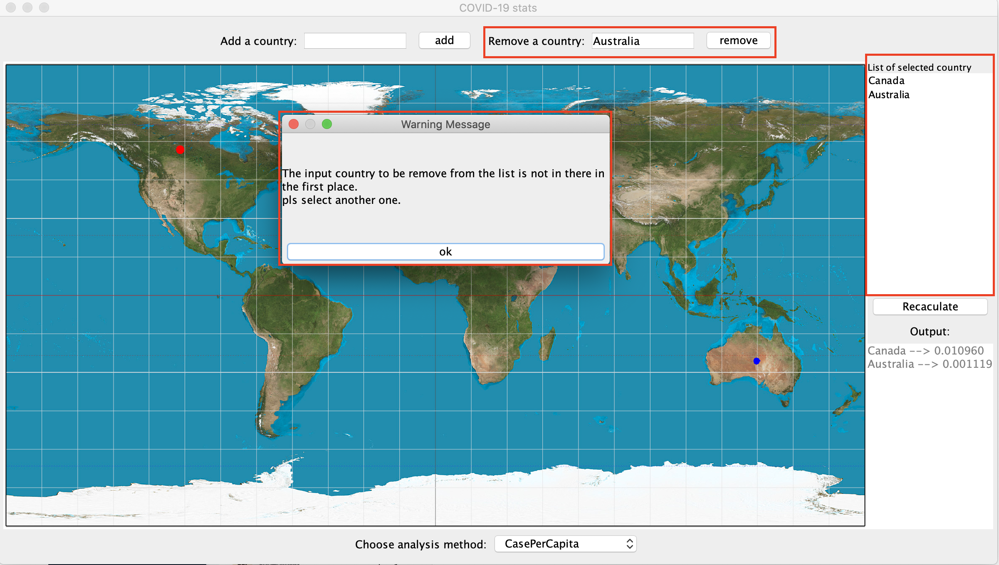
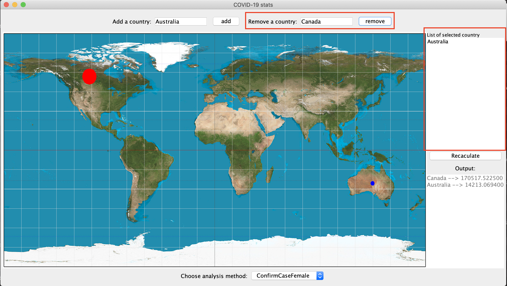
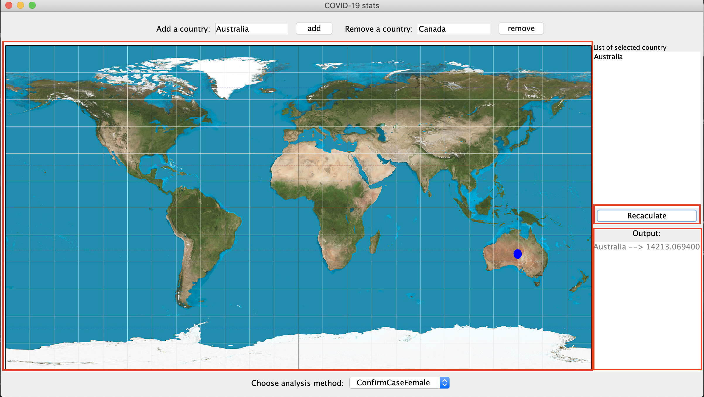

# Statistic-Analyze System of COVID-19

​	This system allows for retrieving COVID-19 infection related data for one or more selected countries, computing different statistics on these data, and display the computed statistics on a map.


### Summary

* [Getting Started](###Getting Started)
* [Runing the tests](###Runing the Tests)
* [Preview](###Preview)
* [Version](###Version) 
* [Modules](###Modules)
* [Authors](###Authors)
* [License](###License)
* [Further Improvement](###Further Improvement)


### Getting Started

#### 	Prerequisites

​		System requirement: jdk 14

​		Language level:  12 - No new language features

​		npm install npm -g

​		$ npm install <Module name>

#### 	Installing

​		Package the covid_analyse_sys as .jar file.

​		Double click on .jar file.

​		Then it is free to run.

#### Start of the system

​		The entry of the application is LoginFrame. Start running from the LoginFrame.

#### Validation of User

​		The user name and password for testing is:

​			user name: tianci

​			password: 123

​		as has been provided in the database.json file under the database folder.

### Runing the Tests

##### 1. The unique ID of the requirement tested 

* The users are greeted with a login window
*  The user inputs a user name
* The user inputs a password
* The user clicks the submit button to log into the system and is presented with the main UI of the application


##### 2. Country-Adding

* The “Add a country” bar is presented to users
* The user types the name of the country or select the country from a drop-down menu on the “Add a country” field
* The user selects the “add” button to add the country to the list of countries to perform analysis of
* An error message displayed on the window


##### 3. Country-Removing

* The “Remove a country” bar is presented to users
*  The user types the name of the country or select the country from a drop-down menu on the “Remove a country” field
* The user selects the “remove” button to remove the country from the list of countries to perform an analysis on
* The country selected is removed from the list of countries, on which analysis is to be performed on


##### 4. Country-Analysis

* The user selects the specific type of analysis they want to perform from a drop-down menu of available analyses (4 different types in total).
* The user presses the “Recalculate” button to perform analysis. 
* The system identifies and retrieves the individual pieces of data required for the type of analysis selected.
* The system performs the calculation and returns the result of analysis.
* The system display the result to the user.


##### 5. Data-Read

* According to the selected analysis type, the system sends a request to web sites to read the specific data required to perform the analysis. 
* All the required individual pieces of data can be found on the website and the website return those data to the system


##### 6. Display-Result

* According to the results of statistical analysis, the system will be able to render the data in different colors (or shapes).
* Display the data on the map intuitive


### Preview


















### Version

​		The following display the version used in the system.

```xml
<properties>
	<gson.version>2.8.6</gson.version>
  <junit.version>4.13</junit.version>
</properties>
```

### Modules

​		In order to achieve the goal of high cohesion, low coupling, in addition to put related methods on the same class, we also add several modules to seperate our tasks. Each module have their individual main task to do. 

​		Modules used in the system and their main task is displayed below:

```xml
<modules>
  <!--covid-stats-ui module is for building the user interface of the system. It also acts as façade to communicate the user interface to with the back end services.-->
	<module>covid-stats-ui</module>
  
  <!--covid_analysis_engine module is to carry out specific analysis operations-->
  <module>covid_analysis_engine</module>
  
  <!--covid_country_perform acts is to operate the list of country, including adding, removing and getting the list of selected country-->
  <module>covid_country_perform</module>
  
  <!--covid_data_retrieve is to retrieve all of the required data from websites or local files. It will provide those data to other classes which need those data to perform specific operations.-->
  <module>covid_data_retrieve</module>
</modules>
```

​		[index.html](./index.html) file is provided and is the overall Javadoc file of the system. 

### Authors

* ##### Tianci Du (tdu27@uwo.ca)

* ##### Xinyi Lin (xlin326@uwo.ca)

* ##### Ziqingqing Ye (zye222@uwo.ca)


### License

​	Distributed under the MIT License. See [License.md](/License.md/) for more information.


### Further Improvement

​	At present, there is only one thread to perform all the application request, including reading file and displaying analysis calculations. Next step, we are planning to add additional threads to perform different functionalities so that the speed of the system will become much more faster.

[Back to top](#Statistic-Analyze System of COVID-19)


